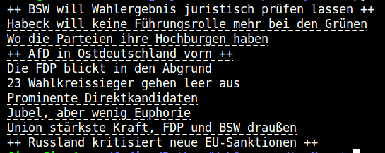

# TopNews
A command-line application that shows you the top 10 news from the Tagesschau website (in german).  

That way you can easily get the most important news without scrolling through the website.  
The headlines are clickable and lead directly to the articles on the Tagesschau website.  

Simply type in:
```console
python3 topNews.py
```
An example of current headlines:  


